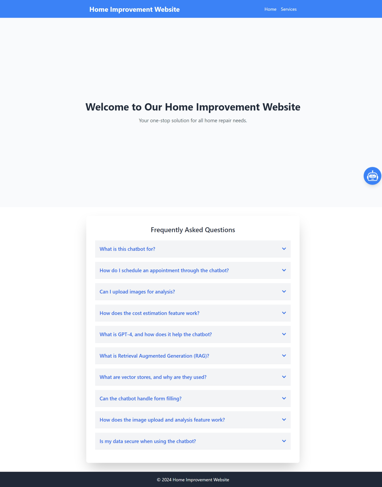
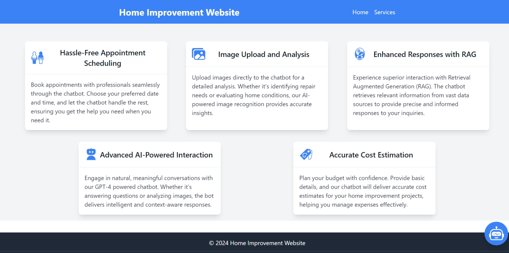
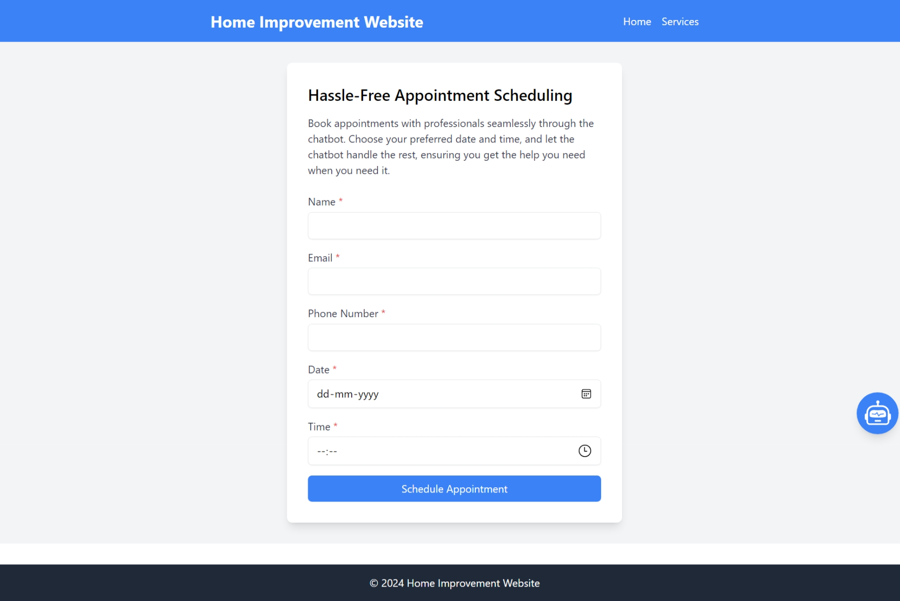
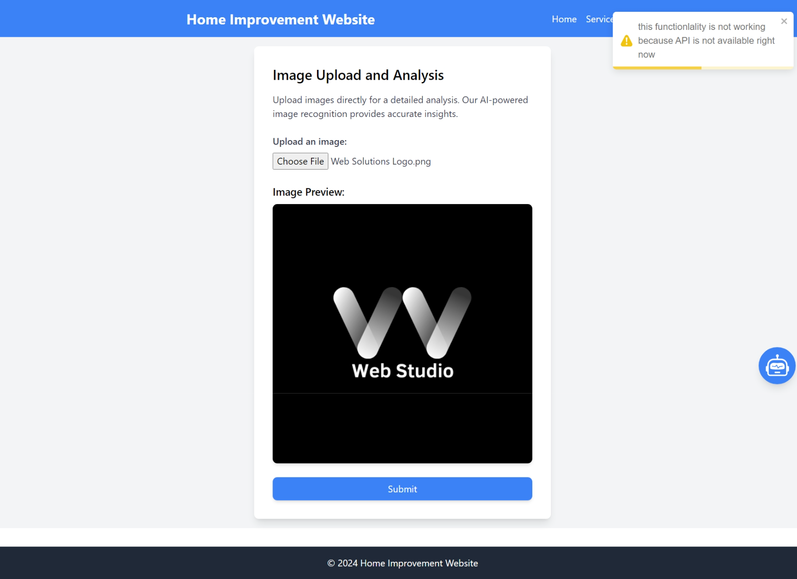
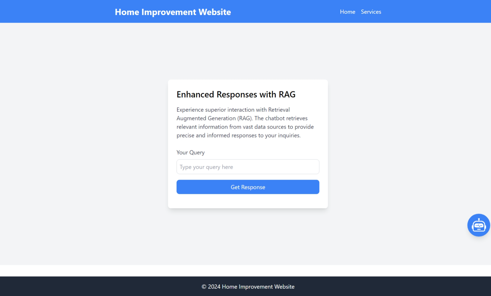
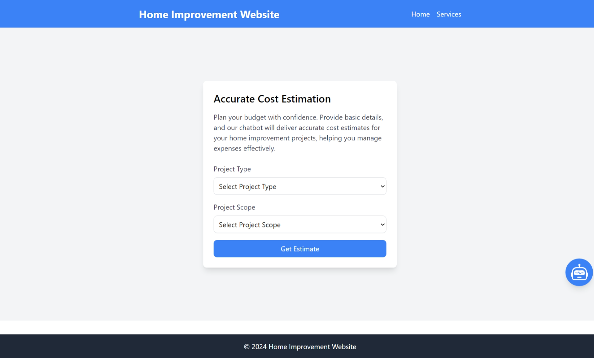

Sure, here's a sample `README.md` file for your platform. This will help others understand the purpose of the platform, how to set it up, and how to use it.

---

# Home Improvement Platform

## Overview

The Home Improvement Platform is a comprehensive web application designed to enhance user interactions with various home improvement services through a range of features. This platform includes functionalities such as appointment scheduling, image upload and analysis, AI-powered interactions, cost estimation, and enhanced responses with Retrieval Augmented Generation (RAG).

## Features

- **Hassle-Free Appointment Scheduling**: Users can book appointments with professionals seamlessly through a user-friendly interface.
- **Image Upload and Analysis**: Upload and analyze images to receive insights on repair needs or home conditions.
- **Advanced AI-Powered Interaction**: Engage in natural conversations with a GPT-4 powered chatbot for intelligent and context-aware responses.
- **Accurate Cost Estimation**: Receive accurate cost estimates for home improvement projects based on user input.
- **Enhanced Responses with RAG**: Get precise and informed responses through Retrieval Augmented Generation.

## Tech Stack

- **Frontend**: React, Tailwind CSS
- **Backend**: Node.js, Express.js (for the REST API, if applicable)
- **AI Integration**: GPT-4, RAG
- **Image Processing**: AI-powered image recognition
- **Routing**: React Router

## Installation

To get started with this platform, follow these steps:

1. **Clone the Repository**

   ```bash
   git clone https://github.com/vaibhavvatsbhartiya/Chat-bot-task.git
   cd home-improvement-platform
   ```

2. **Install Dependencies**

   Ensure you have Node.js and npm installed. Then, run:

   ```bash
   npm install
   ```

3. **Run the Application**

   Start the development server:

   ```bash
   npm start
   ```

   Open your browser and go to `http://localhost:3000` to view the application.

## Project Structure

- `src/`: Contains all the source files for the project.
  - `components/`: Reusable components like `ServiceCard`, `Header`, `Footer`, `SignupForm`, and `LoginForm`.
  - `pages/`: Individual pages such as `Home`, `Services`, and various service detail pages.
  - `provided_service/`: Pages for specific services like `ImageUploadPage`, `AIChatPage`, `RAGPage`, `CostEstimationPage`, and `AppointmentSchedulingPage`.
  - `App.jsx`: Main application component with routing.
  - `index.js`: Entry point for React application.

## Usage

- **Home Page**: The landing page with an overview of the platform.
- **Services Page**: Displays all available services with clickable cards that navigate to detailed pages for each service.
- **Service Detail Pages**: Specific pages for each service, where users can interact with features like scheduling appointments, uploading images, or receiving cost estimates.

## Contributing

Feel free to open issues or submit pull requests if you have suggestions or improvements. Please follow the standard GitHub workflow for contributing.

## License

This project is licensed under the MIT License - see the [LICENSE](LICENSE) file for details.


server code is in node because i encounter error while adding chromaDB. 
```json
{
  "name": "backend",
  "version": "1.0.0",
  "description": "",
  "main": "server.js",
  "scripts": {
    "test": "echo \"Error: no test specified\" && exit 1",
    "start": "node server.js"
  },
  "author": "V2",
  "license": "ISC",
  "dependencies": {
    "axios": "^1.7.4",
    "cors": "^2.8.5",
    "express": "^4.19.2"
  }
}

```

```js

// server.js
const express = require('express');
const axios = require('axios');
const cors = require('cors');

const app = express();
const PORT = 5000;

// Middleware
app.use(express.json());
app.use(cors()); // Enable CORS for all routes


app.get('/', (req,res)=>{
    res.send("Server is running");
})

// Define the POST route
app.post('/api/chat', async (req, res) => {
  const userMessage = req.body.message;

  const options = {
    method: 'POST',
    url: 'url',
    headers: {
      'x-rapidapi-key': 'key',
      'x-rapidapi-host': 'host',
      'Content-Type': 'application/json'
    },
    data: {
      messages: [
        {
          role: 'user',
          content: userMessage
        }
      ]
    }
  };

  try {
    const response = await axios.request(options);
    res.json(response.data);
  } catch (error) {
    console.error('Error fetching data from AI:', error.response ? error.response.data : error.message);
    res.status(500).json({ error: 'Failed to fetch AI response' });
  }
});

app.listen(PORT, () => {
  console.log(`Server is running on http://localhost:${PORT}`);
});

```


For frontend 
1. import code
2. npm run dev
3. http://localhost:5173/

backend: 
you need to pass the url and key from rapid api hub.

Also add some pics
1. home page 
2. Service page 

service1 
service2 
service3 
service4 
service5  